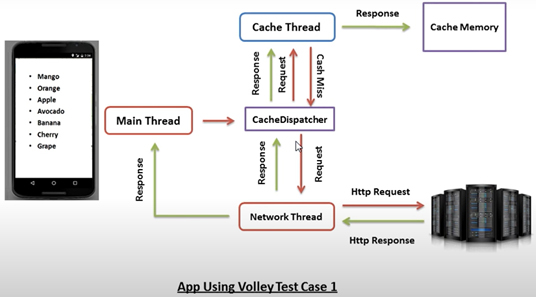
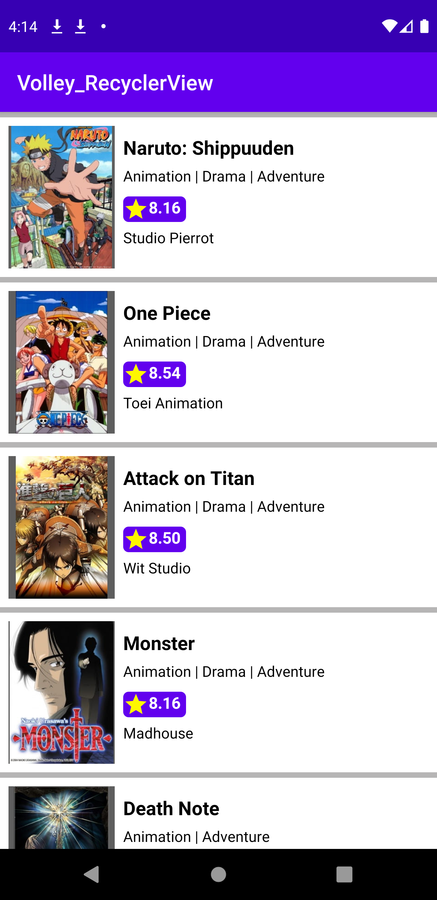

# Volley_RecyclerView
JISON parsing using volley

## What is Volley ?
Volley is an HTTP network library that makes networking for android apps easier ,faster and without a lot of code.\
Volley is developed by Google.

By using Volley for network operations you avoid the standard way to handle networking, HttpURLConnection.\
 Another reason is asynchronicity. Volley handles asynchronicity by itself, there is no need to create Asynctask manually.
In volley there are 3 threads:
1. Main Thread
2. Cache Thread
3. Network Thread

As we see in the photo the main thread will send request to CacheDispatcher, CacheDispatcher will send request to Cache Thread
Cache thread will search for data in cache memory if the data exist then it is cache hit and will send response to CacheDispatcher.
CacheDispatcher will send the response to the main thread. If the data is not exist
in cache memory then it is cache miss so CacheDispatcher will send request to network thread , network thread will send Http request 
to the server , the server will send Http response to Network thread,Network thread will send this response to main thread as well as to 
Cache thread.

# Steps to Implement volley:

Step 1 : Add the dependency in build.gradle(Module: app)

    dependencies {
    ...
    implementation 'com.android.volley:volley:1.1.1'
}

Step 2: Create / Set up the RequestQueue
if you want to use this requestQueue only in on activity you can create it inside onCreate() method

     RequestQueue requestQueue;

    @Override
    protected void onCreate(Bundle savedInstanceState) {
        //...
        requestQueue = Volley.newRequestQueue(this); // 'this' is the Context

    }

for best practice create RequestQueue using Singleton class. This makes the RequestQueue for all the activities

Step 3: Create standrad request there are many requests:
you can create the type of request that you need

3.1: String Request:

    String url = "https:// string_url/"; 
    StringRequest stringRequest 	= new StringRequest( 
	  	Request.Method.GET, url, 	new Response.Listener() { 
		 	@Override
		 	public void onResponse(String response) 
		 	{ 
		 	} 
		 }, 
		 new Response.ErrorListener() { 
			@Override
			public void onErrorResponse(VolleyError error) 
			{ 
			} 
		}); 

3.2: JSONObject Request

    String url = "https:// json_url/"; 
    JsonObjectRequest 
   	jsonObjectRequest 
	= new JsonObjectRequest( 
		Request.Method.GET, 
		url, 
		null, 
		new Response.Listener() { 
			@Override
			public void onResponse(JSONObject response) 
			{ 
			} 
		}, 
		new Response.ErrorListener() { 
			@Override
			public void onErrorResponse(VolleyError error) 
			{ 
			} 
		}); 

3.3: JSONArray Request

    JsonArrayRequest 
   	jsonArrayRequest 
	= new JsonArrayRequest( 
		Request.Method.GET, 
		url, 
		null, 
		new Response.Listener() { 
			@Override
			public void onResponse(JSONArray response) 
			{ 
			} 
		}, 
		new Response.ErrorListener() { 
			@Override
			public void onErrorResponse(VolleyError error) 
			{ 
			} 
		}); 

3.4 : Image Request

    int max - width = ...; 
    int max_height = ...; 

    String URL = "http:// image_url.png"; 

    ImageRequest imageRequest = new ImageRequest(URL, 
					new Response.Listener() { 
						@Override
						public void
						onResponse(Bitmap response) 
						{ 
							// Assign the response 
							// to an ImageView 
	    	ImageView 	imageView 	= (ImageView) 		findViewById( 			R.id.imageView); 
          imageView.setImageBitmap(response); 
						} 
					},
					max_width, max_height, null); 

step 4: Add the request to requestQueue

    requestQueue.add(request); 
    // or use this if you used Singleton class
    Mysingleton.getInstance(getApplicationContext()).addToRequestQueue(jsonArrayRequest);
    
    
 In this project will try to fetch ISON data from server  and will display them in recyclerView
 [This] (https://gist.githubusercontent.com/Ahmed-Basalib10/2a31961953d2887b5c6738f6fc72b232/raw/anime.json) is our JISON data
#Note:
for loading the image you can use Glide or Picasso 

# output

